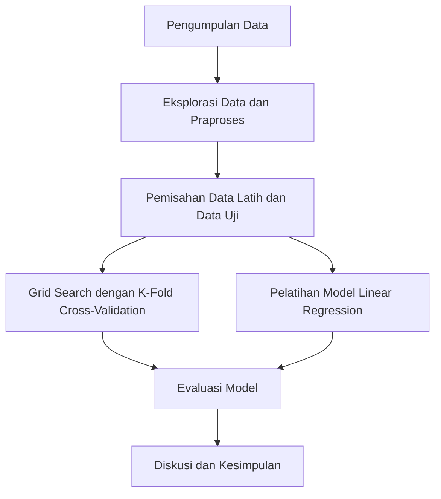

# Prediksi Harga Bahan Pokok Menggunakan XGBoost dan Linear Regression

## Identitas Lengkap
- **Nama:** Dicky Pranata
- **NIM:** A11.2022.14615
- **Mata Kuliah:** Pembelajaran Mesin
- **Dosen:** [Nama Dosen]

---

## 1. Ringkasan dan Permasalahan Project

### Ringkasan
Proyek ini bertujuan untuk memprediksi harga bahan pokok menggunakan algoritma XGBoost dan Linear Regression. Data yang digunakan adalah harga bulanan dari berbagai bahan pokok. Model dibangun untuk memprediksi harga di masa depan berdasarkan data historis.

### Permasalahan
Harga bahan pokok seringkali mengalami fluktuasi yang signifikan karena berbagai faktor ekonomi dan sosial. Memiliki model yang dapat memprediksi harga di masa depan akan sangat berguna untuk perencanaan dan pengambilan keputusan.

### Tujuan
1. Membangun model prediksi harga bahan pokok menggunakan XGBoost dan Linear Regression.
2. Membandingkan kinerja model yang dibangun.
3. Mengidentifikasi fitur-fitur penting yang mempengaruhi harga bahan pokok.

### Model / Alur Penyelesaian



---

## Penjelasan Dataset, EDA dan Proses Features Dataset

### Penjelasan Dataset

Dataset yang digunakan dalam proyek ini berisi data harga bulanan dari berbagai bahan pokok. Dataset ini memiliki kolom-kolom yang mewakili harga bahan pokok setiap bulan dari Januari hingga Desember, serta kolom yang menunjukkan jenis bahan pokok. Berikut adalah kolom-kolom yang ada dalam dataset:

- `januari`: Harga bahan pokok pada bulan Januari
- `februari`: Harga bahan pokok pada bulan Februari
- `maret`: Harga bahan pokok pada bulan Maret
- `april`: Harga bahan pokok pada bulan April
- `mei`: Harga bahan pokok pada bulan Mei
- `juni`: Harga bahan pokok pada bulan Juni
- `juli`: Harga bahan pokok pada bulan Juli
- `agustus`: Harga bahan pokok pada bulan Agustus
- `september`: Harga bahan pokok pada bulan September
- `oktober`: Harga bahan pokok pada bulan Oktober
- `november`: Harga bahan pokok pada bulan November
- `desember`: Harga bahan pokok pada bulan Desember
- `bahan_pokok`: Jenis bahan pokok

### Eksplorasi Data dan Praproses

Eksplorasi Data Awal (EDA) dilakukan untuk memahami distribusi dan pola dalam data. Berikut adalah langkah-langkah yang diambil dalam EDA dan praproses data:

1. **Membaca Dataset**: Dataset dibaca menggunakan `pandas`.
2. **Eksplorasi Data Awal**: Menampilkan beberapa baris pertama dari dataset dan deskripsi statistik dasar.
3. **Visualisasi Data**: Membuat histogram untuk setiap kolom untuk melihat distribusi data.
4. **Pengisian Nilai yang Hilang**: Mengisi nilai yang hilang (jika ada) menggunakan metode forward fill.
5. **Pengkodean Label**: Mengkodekan kolom target (`bahan_pokok`) menggunakan `LabelEncoder`.
6. **Standardisasi Fitur**: Menstandardisasi fitur menggunakan `StandardScaler`.

### Kode EDA dan Praproses

```python
import pandas as pd
import matplotlib.pyplot as plt
from sklearn.preprocessing import LabelEncoder, StandardScaler

# Baca dataset
data = pd.read_csv('DataPenjualan.csv')

# Eksplorasi Data
print(data.head())
print(data.describe())

# Visualisasi distribusi data
data.hist(bins=30, figsize=(15, 10))
plt.show()

# Praproses Data
# Pengisian nilai yang hilang (jika ada)
data.fillna(method='ffill', inplace=True)

# Pengkodean label untuk kolom target
label_encoder = LabelEncoder()
data['bahan_pokok_encoded'] = label_encoder.fit_transform(data['bahan_pokok'])

# Standardisasi fitur
scaler = StandardScaler()
features = data[['januari', 'februari', 'maret', 'april', 'mei', 'juni', 'juli', 'agustus', 'september', 'oktober', 'november', 'desember']]
features_scaled = scaler.fit_transform(features)

# Tambahkan fitur yang sudah distandardisasi ke dataframe
data_scaled = pd.DataFrame(features_scaled, columns=features.columns)
data_scaled['bahan_pokok_encoded'] = data['bahan_pokok_encoded']

