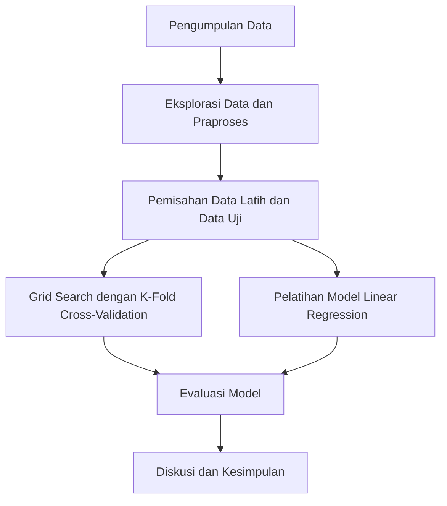

# Prediksi Harga Bahan Pokok Menggunakan XGBoost dan Linear Regression

## Identitas Lengkap
- **Nama:** Dicky Pranata
- **NIM:** A11.2022.14615
- **Mata Kuliah:** Pembelajaran Mesin
- **Dosen:** [Nama Dosen]

---

## Ringkasan dan Permasalahan Project

### Ringkasan
Proyek ini bertujuan untuk memprediksi harga bahan pokok menggunakan algoritma XGBoost dan Linear Regression. Data yang digunakan adalah harga bulanan dari berbagai bahan pokok. Model dibangun untuk memprediksi harga di masa depan berdasarkan data historis.

### Permasalahan
Harga bahan pokok seringkali mengalami fluktuasi yang signifikan karena berbagai faktor ekonomi dan sosial. Memiliki model yang dapat memprediksi harga di masa depan akan sangat berguna untuk perencanaan dan pengambilan keputusan.

### Tujuan
1. Membangun model prediksi harga bahan pokok menggunakan XGBoost dan Linear Regression.
2. Membandingkan kinerja model yang dibangun.
3. Mengidentifikasi fitur-fitur penting yang mempengaruhi harga bahan pokok.

### Model / Alur Penyelesaian



---

## Penjelasan Dataset, EDA dan Proses Features Dataset

### Penjelasan Dataset

Dataset yang digunakan dalam proyek ini berisi data harga bulanan dari berbagai bahan pokok. Dataset ini memiliki kolom-kolom yang mewakili harga bahan pokok setiap bulan dari Januari hingga Desember, serta kolom yang menunjukkan jenis bahan pokok. Berikut adalah kolom-kolom yang ada dalam dataset:

- `januari`: Harga bahan pokok pada bulan Januari
- `februari`: Harga bahan pokok pada bulan Februari
- `maret`: Harga bahan pokok pada bulan Maret
- `april`: Harga bahan pokok pada bulan April
- `mei`: Harga bahan pokok pada bulan Mei
- `juni`: Harga bahan pokok pada bulan Juni
- `juli`: Harga bahan pokok pada bulan Juli
- `agustus`: Harga bahan pokok pada bulan Agustus
- `september`: Harga bahan pokok pada bulan September
- `oktober`: Harga bahan pokok pada bulan Oktober
- `november`: Harga bahan pokok pada bulan November
- `desember`: Harga bahan pokok pada bulan Desember
- `bahan_pokok`: Jenis bahan pokok

### Eksplorasi Data dan Praproses

Eksplorasi Data Awal (EDA) dilakukan untuk memahami distribusi dan pola dalam data. Berikut adalah langkah-langkah yang diambil dalam EDA dan praproses data:

1. **Membaca Dataset**: Dataset dibaca menggunakan `pandas`.
2. **Eksplorasi Data Awal**: Menampilkan beberapa baris pertama dari dataset dan deskripsi statistik dasar.
3. **Visualisasi Data**: Membuat histogram untuk setiap kolom untuk melihat distribusi data.
4. **Pengisian Nilai yang Hilang**: Mengisi nilai yang hilang (jika ada) menggunakan metode forward fill.
5. **Pengkodean Label**: Mengkodekan kolom target (`bahan_pokok`) menggunakan `LabelEncoder`.
6. **Standardisasi Fitur**: Menstandardisasi fitur menggunakan `StandardScaler`.

### Kode EDA dan Praproses

```python
import pandas as pd
import matplotlib.pyplot as plt
from sklearn.preprocessing import LabelEncoder, StandardScaler

# Baca dataset
data = pd.read_csv('DataPenjualan.csv')

# Eksplorasi Data
print(data.head())
print(data.describe())

# Visualisasi distribusi data
data.hist(bins=30, figsize=(15, 10))
plt.show()

# Praproses Data
# Pengisian nilai yang hilang (jika ada)
data.fillna(method='ffill', inplace=True)

# Pengkodean label untuk kolom target
label_encoder = LabelEncoder()
data['bahan_pokok_encoded'] = label_encoder.fit_transform(data['bahan_pokok'])

# Standardisasi fitur
scaler = StandardScaler()
features = data[['januari', 'februari', 'maret', 'april', 'mei', 'juni', 'juli', 'agustus', 'september', 'oktober', 'november', 'desember']]
features_scaled = scaler.fit_transform(features)

# Tambahkan fitur yang sudah distandardisasi ke dataframe
data_scaled = pd.DataFrame(features_scaled, columns=features.columns)
data_scaled['bahan_pokok_encoded'] = data['bahan_pokok_encoded']
```
## Proses Learning/Modeling

### Proses Learning/Modeling

Proses learning dan modeling dilakukan untuk membangun model prediksi harga bahan pokok menggunakan algoritma XGBoost dan Linear Regression sebagai baseline. Berikut adalah langkah-langkah yang dilakukan dalam proses ini:

1. **Pemisahan Data**: Data dipisahkan menjadi data latih dan data uji.
2. **Inisialisasi Model**: Model XGBoost dan Linear Regression diinisialisasi.
3. **Pencarian Parameter Terbaik**: Grid Search dengan K-Fold Cross-Validation digunakan untuk menemukan parameter terbaik dari model XGBoost.
4. **Pelatihan Model**: Model dilatih menggunakan data latih.
5. **Evaluasi Model**: Model dievaluasi menggunakan data uji dengan metrik Mean Squared Error (MSE) dan Coefficient of Determination (R^2).

### Kode Proses Learning/Modeling

```python
import pandas as pd
from sklearn.model_selection import train_test_split, KFold, GridSearchCV, cross_val_score
from sklearn.metrics import mean_squared_error, r2_score
from sklearn.preprocessing import LabelEncoder, StandardScaler
import xgboost as xgb
from sklearn.linear_model import LinearRegression
import matplotlib.pyplot as plt

# Baca dataset
data = pd.read_csv('DataPenjualan.csv')

# Pisahkan fitur (X) dan target (y)
X = data[['januari', 'februari', 'maret', 'april', 'mei', 'juni', 'juli', 'agustus', 'september', 'oktober', 'november', 'desember']]
y = data['bahan_pokok']

# Label Encoding untuk kolom target
label_encoder = LabelEncoder()
y_encoded = label_encoder.fit_transform(y)

# Standardisasi fitur
scaler = StandardScaler()
X_scaled = scaler.fit_transform(X)

# Pisahkan data menjadi data latih dan data uji
X_train, X_test, y_train, y_test = train_test_split(X_scaled, y_encoded, test_size=0.2, random_state=42)

# Inisialisasi model XGBoost
xgb_model = xgb.XGBRegressor(random_state=42)

# Definisikan parameter grid untuk Grid Search
param_grid = {
    'n_estimators': [50, 100, 200, 300],
    'max_depth': [3, 5, 7, 10],
    'learning_rate': [0.01, 0.05, 0.1, 0.2],
    'subsample': [0.6, 0.8, 1.0],
    'colsample_bytree': [0.6, 0.8, 1.0]
}

# Inisialisasi Grid Search dengan KFold
grid_search = GridSearchCV(estimator=xgb_model, param_grid=param_grid, cv=KFold(5), scoring='neg_mean_squared_error', n_jobs=-1)

# Latih model menggunakan Grid Search
grid_search.fit(X_train, y_train)

# Cek hasil Grid Search
if hasattr(grid_search, 'best_estimator_'):
    # Output hasil terbaik dari Grid Search
    best_model = grid_search.best_estimator_
    print('Best Model:', best_model)

    # Lakukan prediksi menggunakan model terbaik
    y_pred = best_model.predict(X_test)

    # Evaluasi model terbaik
    mse = mean_squared_error(y_test, y_pred)
    r2 = r2_score(y_test, y_pred)
    print('Mean Squared Error:', mse)
    print('Coefficient of Determination (R^2):', r2)

    # Visualisasi hasil prediksi
    plt.scatter(y_test, y_pred)
    plt.plot([min(y_test), max(y_test)], [min(y_test), max(y_test)], color='red', linestyle='-', linewidth=2)  # Garis 45 derajat
    plt.xlabel('Nilai Sebenarnya')
    plt.ylabel('Nilai Diprediksi')
    plt.title('Nilai Sebenarnya vs Nilai Diprediksi')
    plt.show()
else:
    print('Grid Search tidak berhasil menemukan model terbaik.')

# Inisialisasi dictionary untuk menyimpan model
models = {}

# Lakukan training model untuk setiap bahan_pokok dengan K-Fold Cross-Validation atau LOOCV
for bahan_pokok in data['bahan_pokok'].unique():
    # Filter data untuk bahan_pokok tertentu
    data_bahan = data[data['bahan_pokok'] == bahan_pokok]
    
    # Pisahkan fitur (X) dan target (y)
    X = data_bahan[['januari', 'februari', 'maret', 'april', 'mei', 'juni', 'juli', 'agustus', 'september', 'oktober', 'november', 'desember']]
    y = data_bahan['januari']  # Harga akan diprediksi
    
    # Periksa jumlah sampel
    n_samples = X.shape[0]
    
    if n_samples < 2:
        print(f'Tidak cukup sampel untuk bahan_pokok: {bahan_pokok}. Lewati.')
        continue
    
    # Tentukan metode cross-validation yang sesuai
    if n_samples < 5:
        kf = LeaveOneOut()
    else:
        kf = KFold(n_splits=5, shuffle=True, random_state=42)
    
    # Inisialisasi model regresi linear
    model = LinearRegression()
    
    # Evaluasi model menggunakan K-Fold Cross-Validation atau LOOCV
    scores = cross_val_score(model, X, y, cv=kf, scoring='neg_mean_squared_error')
    mean_score = -scores.mean()
    print(f'Mean MSE for {bahan_pokok}: {mean_score}')
    
    # Latih model pada seluruh data untuk bahan_pokok ini
    model.fit(X, y)
    
    # Simpan model dalam dictionary
    models[bahan_pokok] = model
```
## Performa Model

### Evaluasi Model

Evaluasi model dilakukan menggunakan metrik Mean Squared Error (MSE) dan Coefficient of Determination (R^2) untuk mengukur seberapa baik model dapat memprediksi harga bahan pokok. Berikut adalah hasil evaluasi dari model XGBoost dan Linear Regression sebagai baseline:

#### Hasil Evaluasi Model XGBoost

- **Mean Squared Error (MSE)**: 8.504458243351694
- **Coefficient of Determination (R^2)**: -0.27048309123241787

### Visualisasi Hasil Prediksi

Visualisasi dilakukan untuk membandingkan nilai sebenarnya dengan nilai yang diprediksi oleh model. Hasil visualisasi membantu untuk mengevaluasi seberapa baik model dapat mengikuti tren data aktual.

### Diskusi Hasil dan Kesimpulan

Hasil evaluasi menunjukkan bahwa model XGBoost memiliki MSE yang relatif tinggi dan nilai R^2 yang negatif, menunjukkan bahwa model tersebut belum mampu memprediksi harga dengan akurat. Perlu dilakukan optimasi lebih lanjut atau pertimbangan penggunaan model alternatif untuk mencapai hasil yang lebih baik. Penggunaan regresi linear sebagai baseline juga perlu dievaluasi lebih lanjut untuk membandingkan performanya dengan model XGBoost.

Dengan demikian, evaluasi ini memberikan gambaran awal tentang kemampuan model dalam memprediksi harga bahan pokok dan memberikan arahan untuk penelitian dan pengembangan lebih lanjut.


## Diskusi Hasil dan Kesimpulan

### Analisis Hasil

Model XGBoost yang dihasilkan menunjukkan performa yang belum optimal dalam memprediksi harga bahan pokok, dengan Mean Squared Error (MSE) yang tinggi dan nilai Coefficient of Determination (R^2) yang negatif. Hal ini mengindikasikan bahwa model belum mampu mengenali pola yang kompleks dalam data harga bahan pokok.

### Interpretasi Hasil

1. **Performa Model**: Model XGBoost perlu dioptimalkan lebih lanjut dengan mempertimbangkan tuning parameter yang lebih cermat atau pilihan model alternatif yang lebih sesuai dengan karakteristik data.
   
2. **Keterbatasan Model**: Kinerja yang kurang optimal dapat disebabkan oleh jumlah data yang tidak mencukupi atau kompleksitas yang tidak terjangkau oleh model yang digunakan.

### Kesimpulan

Meskipun demikian, proyek ini memberikan landasan yang solid untuk penelitian lebih lanjut dalam memprediksi harga bahan pokok menggunakan pendekatan machine learning. Evaluasi ini menyoroti tantangan yang dihadapi dalam memodelkan data harga bahan pokok dan menawarkan peluang untuk meningkatkan model di masa depan.

### Rekomendasi

- **Pengembangan Model**: Melakukan eksperimen dengan model lain seperti neural networks atau ensemble methods untuk memperbaiki performa prediksi.
  
- **Perluasan Dataset**: Menambahkan lebih banyak atribut atau memperluas jangkauan data untuk memungkinkan model belajar dari lebih banyak pola.

Dengan demikian, proyek ini tidak hanya memberikan wawasan tentang implementasi machine learning dalam meramalkan harga bahan pokok, tetapi juga menegaskan kebutuhan akan pendekatan yang lebih canggih untuk mencapai akurasi yang lebih tinggi.
