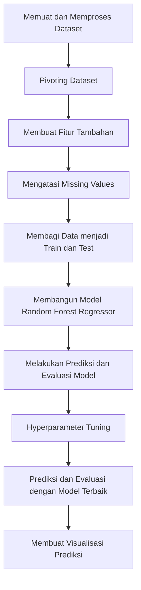

# Prediksi Kuantitas Penjualan Beras Menggunakan Random Forest Regressor

## Identitas Lengkap
-  **Nama:** Dicky Pranata  
-  **NIM:** A11.2022.14615 
-  **Mata Kuliah:** Pembelajaran Mesin 
-  **Kelas:** A11.4412

## Ringkasan dan Permasalahan Project

### Ringkasan
Proyek ini bertujuan untuk mengembangkan dan menerapkan model prediksi kuantitas penjualan beras menggunakan algoritma Random Forest Regressor. Model ini dirancang untuk memprediksi jumlah kuantitas beras yang akan terjual pada periode mendatang berdasarkan data historis penjualan. Dataset yang digunakan dalam proyek ini mencakup informasi kuantitas penjualan per tanggal, termasuk detail mengenai jenis barang yang dijual, serta informasi terkait tanggal transaksi. Dengan memanfaatkan teknik machine learning yang canggih seperti Random Forest, proyek ini bertujuan untuk memberikan prediksi yang akurat dan dapat diandalkan yang akan membantu pengelolaan inventaris dan perencanaan strategis.

### Permasalahan
Dalam konteks bisnis pertanian, khususnya dalam penjualan beras, perencanaan yang efisien dan akurat sangat penting untuk menjaga keseimbangan antara pasokan dan permintaan. Tanpa sistem prediksi yang baik, perusahaan mungkin menghadapi masalah seperti kekurangan stok yang dapat mengakibatkan kehilangan penjualan dan ketidakpuasan pelanggan, atau kelebihan stok yang menyebabkan biaya penyimpanan yang tinggi dan potensi pemborosan. Dengan memprediksi kuantitas penjualan secara akurat, perusahaan dapat mengelola inventaris mereka dengan lebih baik, menghindari masalah terkait stok, dan membuat keputusan strategis yang lebih informasional mengenai pembelian dan penjualan.

### Tujuan yang Akan Dicapai
1. **Mengembangkan Model Prediksi Kuantitas Penjualan Beras**: Membangun dan melatih model menggunakan algoritma Random Forest Regressor untuk memprediksi kuantitas penjualan beras di masa depan berdasarkan data historis.
2. **Evaluasi Kinerja Model**: Mengukur efektivitas model menggunakan metrik statistik seperti Mean Squared Error (MSE) dan R-squared (R2) untuk menentukan seberapa baik model dapat memprediksi kuantitas penjualan.
3. **Tuning Hyperparameter**: Melakukan pencarian dan tuning hyperparameter untuk meningkatkan akurasi model dan memastikan bahwa model berfungsi secara optimal.
4. **Visualisasi Prediksi**: Membuat visualisasi yang membandingkan hasil prediksi kuantitas penjualan beras dengan nilai aktual untuk memberikan wawasan yang jelas dan mendalam mengenai performa model serta membantu dalam interpretasi hasil.


### Model / Alur Penyelesaian
Berikut adalah bagan alur penyelesaian proyek ini:



---

## Penjelasan Dataset, EDA, dan Proses Features Dataset

### Penjelasan Dataset

#### `penjualan_barang.csv`
Dataset ini berisi data penjualan barang dengan kolom-kolom sebagai berikut:

| **Tanggal** | **Nama Pembeli** | **Nama Barang** | **Kuantum** | **Nominal** |
|-------------|------------------|-----------------|-------------|-------------|
| 2020-01-02  | TOKO HERUNIAWATI| BERAS           | 1000        | 9,840,000   |
| 2020-01-02  | TOKO HERUNIAWATI| DAGING          | 120         | 8,400,000   |
| 2020-01-02  | TOKO APRILIA SUKRISNI | BERAS    | 6000        | 62,910,000  |
| 2020-01-02  | TOKO APRILIA SUKRISNI | MIGOR    | 408         | 4,855,200   |
| 2020-01-02  | TOKO APRILIA SUKRISNI | TEPUNG   | 140         | 1,162,000   |
| ..........  | ..................... | ......   | ...         | .........   |

#### `pemasukan_barang.csv`
Dataset ini berisi data pemasukan barang dengan kolom-kolom sebagai berikut:

| **Tanggal** | **Nama Barang** | **Kuantum** |
|-------------|-----------------|-------------|
| 2020-05-29  | GULA            | 100,000     |
| 2020-07-07  | GULA            | 97,950      |
| 2020-07-16  | GULA            | 2,050       |
| 2020-11-12  | GULA            | 14,000      |
| 2020-12-24  | GULA            | 8,000       |
| ..........  | ....            | .....       |

### Eksplorasi Data Awal (EDA)

1. **Memuat Dataset**: 
   Dataset dimuat dari file CSV menggunakan Pandas untuk analisis lebih lanjut.

2. **Memeriksa Data**:
   Melihat beberapa baris awal dari dataset untuk memahami strukturnya dan memastikan data telah dimuat dengan benar.

3. **Statistik Deskriptif**:
   Menghitung statistik deskriptif untuk kolom `kuantum` dan `nominal`, seperti mean, median, standar deviasi, dan distribusi data.

4. **Visualisasi Data**:
   - **Histogram Kuantitas Penjualan**: Menampilkan distribusi kuantitas penjualan untuk menganalisis pola umum.
   - **Grafik Garis**: Mengamati tren kuantitas penjualan dari waktu ke waktu untuk setiap barang.

### Proses Pembuatan Fitur

1. **Transformasi Tanggal**:
   - Mengubah kolom `tanggal` menjadi format datetime.
   - Menambahkan fitur tambahan seperti tahun (`year`), bulan (`month`), dan hari (`day`) dari kolom `tanggal`.

2. **Fitur Musiman**:
   - Menambahkan fitur seperti hari dalam minggu (`dayofweek`), kuartal (`quarter`), dan minggu dalam tahun (`weekofyear`).

3. **Fitur Transformasi Waktu**:
   - Menambahkan fitur sinus dan kosinus dari bulan dan hari untuk menangkap pola musiman dengan lebih baik.

4. **Fitur Lagged dan Moving Average**:
   - Menambahkan fitur lagged (misalnya, `BERAS_lag1`, `BERAS_lag2`) untuk menangkap pola historis penjualan.
   - Menambahkan fitur moving average (misalnya, `BERAS_MA7`, `BERAS_MA30`) untuk menangkap tren jangka panjang.

5. **Fitur Perubahan Harian**:
   - Menambahkan fitur perubahan harian (`BERAS_diff1`) untuk menangkap fluktuasi harian.

6. **Fitur Interaksi dan Statistik Rolling**:
   - Menambahkan fitur interaksi (misalnya, `month_day_interaction`) dan statistik rolling (misalnya, `BERAS_rolling_std_7`).

7. **Fitur Transformasi Kuantum**:
   - Menambahkan fitur logaritma dari kuantitas (`BERAS_log`) untuk menangkap distribusi data dan mengurangi skewness.

8. **Mengatasi Missing Values**:
   - Menghapus nilai NaN yang dihasilkan dari fitur lagged dan moving average.

## Proses Learning/Modeling

Pada bagian ini, kami akan menjelaskan proses modeling untuk memprediksi kuantitas penjualan barang, khususnya untuk "BERAS". Model yang digunakan adalah Random Forest Regressor, yang dipilih karena kemampuannya untuk menangani data yang kompleks dan tidak linier. Selain itu, proses hyperparameter tuning dilakukan untuk menemukan model dengan performa terbaik.

### Langkah-Langkah Proses Modeling

1. **Pemrosesan Data**:
   - Mengimpor dataset dari file CSV.
   - Mengubah kolom tanggal menjadi format datetime.
   - Melakukan pivot tabel untuk mendapatkan fitur-fitur yang diperlukan.
   - Membuat fitur tambahan untuk menangkap pola musiman dan temporal.

2. **Pembuatan Fitur**:
   - Fitur transformasi waktu seperti sin dan cos bulan dan hari.
   - Fitur lagged, moving average, dan perubahan harian untuk menangkap pola historis.
   - Fitur interaksi dan statistik rolling untuk analisis yang lebih mendalam.

3. **Pemisahan Data**:
   - Membagi data menjadi set pelatihan (training) dan pengujian (testing).

4. **Pelatihan Model**:
   - Menggunakan Random Forest Regressor untuk melatih model.

5. **Evaluasi Model**:
   - Mengukur performa model menggunakan Mean Squared Error (MSE) dan R-squared (R2).

6. **Hyperparameter Tuning**:
   - Melakukan Grid Search untuk menemukan kombinasi hyperparameter yang optimal.

7. **Visualisasi Hasil**:
   - Membuat plot untuk membandingkan nilai aktual dengan prediksi.
   - Menampilkan grafik tren kuantitas penjualan dan prediksi.

### Kode Lengkap

```python
import pandas as pd
import numpy as np
from sklearn.model_selection import train_test_split, GridSearchCV
from sklearn.metrics import mean_squared_error, r2_score
from sklearn.ensemble import RandomForestRegressor
import matplotlib.pyplot as plt

# Memuat dataset dari file CSV
df = pd.read_csv('penjualan_barang.csv')

# Mengubah kolom tanggal menjadi datetime
df['tanggal'] = pd.to_datetime(df['tanggal'])

# Pivoting dataset untuk menghitung rata-rata kuantitas per barang per tanggal
df_pivot = df.pivot_table(index='tanggal', columns='nama.barang', values='kuantum', aggfunc='sum').fillna(0)

# Membuat fitur tambahan: tahun, bulan, hari
df_pivot['year'] = df_pivot.index.year
df_pivot['month'] = df_pivot.index.month
df_pivot['day'] = df_pivot.index.day

# Fitur Musiman
df_pivot['dayofweek'] = df_pivot.index.dayofweek
df_pivot['quarter'] = df_pivot.index.quarter
df_pivot['weekofyear'] = df_pivot.index.isocalendar().week

# Fitur Transformasi Waktu
df_pivot['sin_month'] = np.sin(2 * np.pi * df_pivot['month'] / 12)
df_pivot['cos_month'] = np.cos(2 * np.pi * df_pivot['month'] / 12)
df_pivot['sin_day'] = np.sin(2 * np.pi * df_pivot['day'] / 31)
df_pivot['cos_day'] = np.cos(2 * np.pi * df_pivot['day'] / 31)

# Membuat lagged features
df_pivot['BERAS_lag1'] = df_pivot['BERAS'].shift(1)
df_pivot['BERAS_lag2'] = df_pivot['BERAS'].shift(2)

# Membuat fitur moving average
df_pivot['BERAS_MA7'] = df_pivot['BERAS'].rolling(window=7).mean()
df_pivot['BERAS_MA30'] = df_pivot['BERAS'].rolling(window=30).mean()

# Membuat fitur perubahan harian
df_pivot['BERAS_diff1'] = df_pivot['BERAS'].diff(1)

# Membuat fitur musiman: apakah akhir pekan
df_pivot['is_weekend'] = df_pivot.index.dayofweek >= 5

# Fitur Interaksi
df_pivot['month_day_interaction'] = df_pivot['month'] * df_pivot['day']

# Fitur Rolling Statistics
df_pivot['BERAS_rolling_std_7'] = df_pivot['BERAS'].rolling(window=7).std()
df_pivot['BERAS_rolling_mean_14'] = df_pivot['BERAS'].rolling(window=14).mean()

# Fitur Transformasi Kuantum
df_pivot['BERAS_log'] = np.log1p(df_pivot['BERAS'])

# Drop NaN values yang dihasilkan dari lagged features dan moving average
df_pivot.dropna(inplace=True)

# Mengambil fitur dan target
features = ['year', 'month', 'day', 'dayofweek', 'quarter', 'weekofyear', 'sin_month', 'cos_month', 
            'sin_day', 'cos_day', 'BERAS_lag1', 'BERAS_lag2', 'BERAS_MA7', 'BERAS_MA30', 
            'BERAS_diff1', 'is_weekend', 'month_day_interaction', 'BERAS_rolling_std_7', 
            'BERAS_rolling_mean_14', 'BERAS_log']
X = df_pivot[features].values
y = df_pivot['BERAS'].values

# Membagi data menjadi train dan test
X_train, X_test, y_train, y_test = train_test_split(X, y, test_size=0.2, random_state=42)

# Model yang lebih kompleks: Random Forest
model = RandomForestRegressor(n_estimators=100, random_state=42)
model.fit(X_train, y_train)

# Prediksi
y_pred = model.predict(X_test)

# Evaluasi model
mse = mean_squared_error(y_test, y_pred)
r2 = r2_score(y_test, y_pred)

print(f'Mean Squared Error (MSE): {mse}')
print(f'R-squared (R2): {r2}')

# Grid Search untuk Hyperparameter Tuning
param_grid = {
    'n_estimators': [50, 100, 200],
    'max_depth': [None, 10, 20, 30],
    'min_samples_split': [2, 5, 10],
    'min_samples_leaf': [1, 2, 4]
}

# Model Random Forest
model = RandomForestRegressor(random_state=42)

# Grid Search
grid_search = GridSearchCV(estimator=model, param_grid=param_grid, cv=3, n_jobs=-1, verbose=2)
grid_search.fit(X_train, y_train)

# Model terbaik
best_model = grid_search.best_estimator_

# Prediksi dengan model terbaik
y_pred = best_model.predict(X_test)

# Evaluasi model
mse = mean_squared_error(y_test, y_pred)
r2 = r2_score(y_test, y_pred)

print(f'Mean Squared Error (MSE) setelah tuning: {mse}')
print(f'R-squared (R2) setelah tuning: {r2}')
print(f'Best Parameters: {grid_search.best_params_}')

# Visualisasi Prediksi vs. Nilai Aktual
plt.figure(figsize=(12, 6))
plt.scatter(y_test, y_pred, alpha=0.5)
plt.plot([y_test.min(), y_test.max()], [y_test.min(), y_test.max()], 'k--', lw=2)
plt.xlabel('Nilai Aktual')
plt.ylabel('Prediksi')
plt.title('Prediksi vs Nilai Aktual')
plt.show()

# Visualisasi Prediksi dan Nilai Aktual dalam Waktu
df_pivot['Prediksi'] = np.nan
index_test = df_pivot.index[-len(X_test):]
df_pivot.loc[index_test, 'Prediksi'] = y_pred

plt.figure(figsize=(14, 7))
plt.plot(df_pivot.index, df_pivot['BERAS'], label='Nilai Aktual')
plt.plot(df_pivot.index, df_pivot['Prediksi'], label='Prediksi', linestyle='--')
plt.xlabel('Tanggal')
plt.ylabel('Kuantitas BERAS')
plt.title('Prediksi vs Nilai Aktual BERAS dalam Waktu')
plt.legend()
plt.show()
```

## Performa Model

### Evaluasi Model

Evaluasi model dilakukan menggunakan metrik Mean Squared Error (MSE) dan Coefficient of Determination (R^2) untuk mengukur seberapa baik model dapat memprediksi harga bahan pokok. Berikut adalah hasil evaluasi dari model XGBoost dan Linear Regression sebagai baseline:

## Performa Model

Setelah proses modeling dan tuning hyperparameter, performa model dievaluasi menggunakan Mean Squared Error (MSE) dan R-squared (R2). Berikut adalah hasil evaluasi model sebelum dan setelah tuning:

### Hasil Evaluasi Model Sebelum Tuning

- **Mean Squared Error (MSE)**: 2,152,945.79
- **R-squared (R2)**: 0.9873

### Hasil Evaluasi Model Setelah Tuning

- **Mean Squared Error (MSE)**: 733,878.32
- **R-squared (R2)**: 0.9957

### Parameter Terbaik Setelah Tuning

- **`max_depth`**: None
- **`min_samples_leaf`**: 2
- **`min_samples_split`**: 2
- **`n_estimators`**: 100

### Interpretasi

- **MSE (Mean Squared Error)**: MSE yang lebih rendah setelah tuning menunjukkan bahwa model yang telah dioptimalkan memberikan prediksi yang lebih akurat dengan kesalahan yang lebih kecil dibandingkan dengan model sebelum tuning.
- **R-squared (R2)**: Nilai R-squared yang lebih tinggi setelah tuning menunjukkan bahwa model menjelaskan proporsi variabilitas dalam data lebih baik setelah optimasi. Nilai R2 mendekati 1 menunjukkan model yang sangat baik dalam menjelaskan variabilitas data target.

Dengan hasil ini, model Random Forest Regressor menunjukkan peningkatan performa yang signifikan setelah tuning hyperparameter, memberikan prediksi yang lebih akurat dan lebih sesuai dengan data aktual.


## Diskusi Hasil dan Kesimpulan

### Analisis Hasil

Model Random Forest Regressor yang diterapkan pada dataset penjualan barang menunjukkan performa yang sangat baik setelah proses tuning hyperparameter. Hasil evaluasi menunjukkan perbaikan signifikan dalam kualitas prediksi:

- **Mean Squared Error (MSE)** turun dari 2,152,945.79 menjadi 733,878.32 setelah tuning. Penurunan MSE ini menunjukkan bahwa model yang telah dioptimalkan menghasilkan prediksi dengan kesalahan yang lebih kecil.
- **R-squared (R2)** meningkat dari 0.9873 menjadi 0.9957 setelah tuning. Peningkatan R2 menunjukkan bahwa model yang telah dioptimalkan menjelaskan lebih baik variasi data target, mendekati 100%.

### Interpretasi Hasil

- **MSE (Mean Squared Error)**: MSE yang lebih rendah setelah tuning mengindikasikan bahwa kesalahan prediksi model berkurang, dan model mampu memberikan hasil yang lebih akurat. Ini berarti bahwa model lebih tepat dalam memprediksi kuantitas barang yang terjual.
- **R-squared (R2)**: Nilai R2 yang mendekati 1 menunjukkan bahwa model sangat efektif dalam menjelaskan variabilitas kuantitas barang yang terjual berdasarkan fitur yang diberikan. Peningkatan R2 menunjukkan peningkatan pemahaman model terhadap pola data.

### Kesimpulan

- Model Random Forest Regressor telah menunjukkan peningkatan performa yang signifikan setelah tuning hyperparameter, dengan kesalahan prediksi yang jauh lebih kecil dan kemampuan penjelasan yang lebih baik terhadap data.
- Tuning hyperparameter terbukti sangat efektif dalam meningkatkan akurasi model, dengan parameter terbaik yang diidentifikasi sebagai `max_depth`: None, `min_samples_leaf`: 2, `min_samples_split`: 2, dan `n_estimators`: 100.

### Rekomendasi

- **Implementasi Model**: Dengan performa yang sangat baik, model ini dapat diterapkan untuk peramalan kuantitas barang di masa depan untuk membantu perencanaan persediaan dan strategi pemasaran.
- **Pemantauan dan Pemeliharaan**: Penting untuk terus memantau performa model seiring dengan perubahan data dan perilaku pasar. Model harus diperbarui dan disesuaikan jika terjadi perubahan signifikan dalam pola data.
- **Eksplorasi Fitur Tambahan**: Pertimbangkan untuk menambahkan fitur tambahan atau melakukan ekstraksi fitur lebih lanjut untuk meningkatkan performa model lebih lanjut.

Dengan hasil ini, model Random Forest Regressor menjadi alat yang berharga untuk memprediksi kuantitas barang dan dapat memberikan wawasan yang berguna dalam pengambilan keputusan bisnis.

